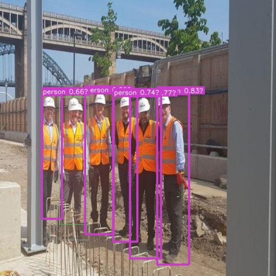
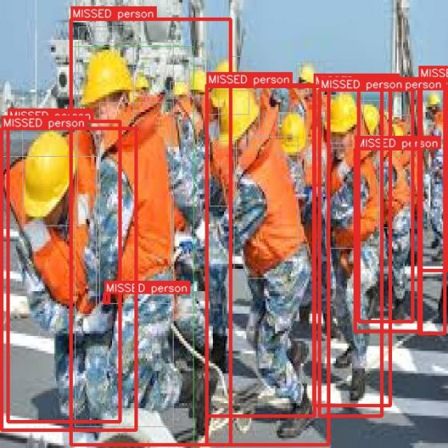
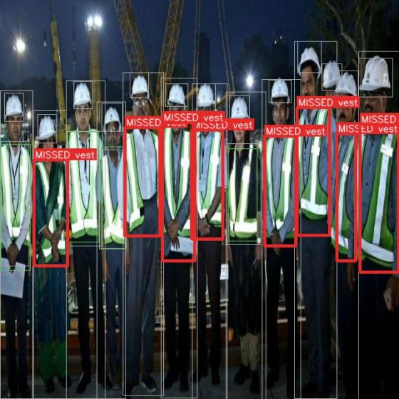
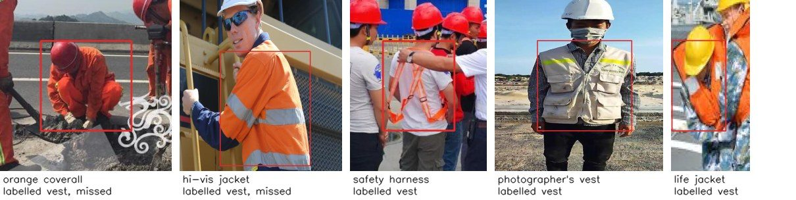
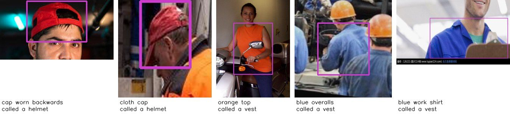
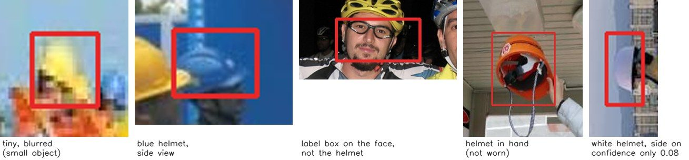

# Phase 1: how the baseline detector fails

**Model:** `models/ppe3_yolo26n_baseline.pt`. YOLO26n fine-tuned on the Mac's GPU, 23 Sep 2026.
**Measured on:** the `ppe3` test split: 200 images with 409 people, 350 helmets and 270 vests. None of
these images were used in training.
**Working threshold:** 0.35, the best-F1 point on the validation split.
**Reproduce:** `bash scripts/mac_phase1.sh review`, which runs `scripts/review_mistakes.py`. It rebuilds the
counts below and the mistake gallery in `runs/review/`.

## The result in brief

| | AP@50 | Precision | Recall | Recall on small objects |
|---|---|---|---|---|
| person | 0.838 | 0.826 | 0.848 | 0/3 (too few to judge) |
| helmet | 0.921 | 0.880 | 0.857 | 0.46 (24 helmets) |
| vest | 0.849 | 0.852 | 0.789 | none in test |
| **all (mAP@50)** | **0.869** | | | |

- **Target check.** The project target is mAP@50 ≥ 0.85, and the public test split reaches 0.869. That target
  is defined on *your* held-out scenes, though. This split comes from the same two datasets the model trained
  on, so it isn't the real test. The real test needs your own clips (`data/README.md`).
- **Two scorers agree.** Ultralytics' own validator gives 0.872 on the same images.
- **Before fine-tuning.** The COCO-pretrained model already found people at AP@50 0.804 on this split.
  Fine-tuning added only 0.034 for people. Most of what it learned is helmets and vests. Failure case 1 below
  shows why the person score can't rise much: the test labels miss many people.
- **Reproducible training.** The run stopped early after 54 of 60 epochs; the best epoch was 39. It took 242
  minutes because two copies ran on the GPU at the same time (see the end of this document). The two copies
  produced identical losses and scores at every epoch.

## What kind of errors they are

At the working threshold the model made **169 misses** and **151 false boxes**.

| | person | helmet | vest |
|---|---|---|---|
| **Missed** | **62** | **50** | **57** |
| … found, but confidence below 0.35 | 16 | 23 | 33 |
| … a box nearby, but too far off (IoU 0.1–0.5) | 25 | 16 | 9 |
| … a good box, but it went to an overlapping neighbour | 8 | 1 | 2 |
| … nothing there at any confidence | 13 | 10 | 13 |
| **False boxes** | **73** | **41** | **37** |
| … nothing labelled nearby ("false alarm") | 50 | 25 | 24 |
| … near a labelled object but too far off | 15 | 11 | 8 |
| … right place, wrong class | 6 | 1 | 1 |
| … second box on the same object | 2 | 4 | 4 |

What the table shows:

- **Low confidence causes most helmet and vest misses.** 23 of 50 missed helmets and 33 of 57 missed vests
  were found in the right place, but with too little confidence.
- **Most missed people had a box nearby.** 33 of 62 had a box that was badly placed or given to a neighbour,
  usually because people overlapped.
- **Few objects are missed completely.** Only 36 of 169 misses had no box of the right class anywhere near
  them.

## The failure cases

### 1. The test labels miss many real people, helmets and vests

I checked by eye every "false alarm": a confident box with no label nearby.

- **People:** about 45 of the 50 are real people nobody labelled.
- **Helmets:** about 18 of 25 are real helmets.
- **Vests:** about 15 of 24 are real hi-vis garments.

In some images almost nobody is labelled. Below, 6 of 7 workers have no "person" label, so all six of the
model's correct boxes (magenta) count as errors.

**What it means:**
- **Precision is understated.** If those boxes were counted as correct, precision would be about 0.93 for
  person, 0.93 for helmet and 0.91 for vest, instead of 0.83 / 0.88 / 0.85.
- **The working threshold is pushed up.** It is picked on validation labels with the same gaps, which makes
  false alarms look more common than they are.

**What to do:**
- Don't tune anything on this split's precision.
- When you label your own clips, label **every** person, helmet and vest, including people in the background.

### 2. Crowds: overlapping people are found as one or not at all

When people stand shoulder to shoulder, boxes land between two people or go to a neighbour.

- **Sailors hauling a rope (below):** 12 of 13 people and all 6 life jackets were missed. The single thin
  green box is the only person the model found.
- **The worst validation image:** a rafting group, with 23 misses.

Both scenes are also unlike a work site.

**What it means for Phase 2:**
- Gates, queues and group work are exactly where crowds happen. A merged or missing person box breaks two
  things there: tracking IDs, and matching each helmet and vest to the right person.
- Phase 2 should measure ID swaps on a crowded clip. It should also not assume one person box per person.

### 3. Real helmets and vests found with too little confidence

This matters most for this project: **every missed helmet or vest is a false "no PPE" alarm** for a worker
who is wearing it.

The clearest case is a night photo of a site team (below):
- all 11 people and 11 of 13 helmets were found;
- **8 of the 12 hi-vis vests were missed**, although the model had boxes on them with confidences of
  0.01–0.23.

**What it means for Phase 2:**
- **Don't alarm on a single frame.** With per-frame vest recall of 0.79, about 1 frame in 5 would wrongly show
  a vested worker without a vest. Phase 2's plan handles this: a violation has to last for a set time on a
  tracked person before an alert.
- **Consider per-class thresholds.** The best-F1 thresholds on validation are 0.40 for person, 0.25 for
  helmet and 0.35 for vest. At 0.25, helmet recall on test rises from 0.857 to 0.894, while precision drops
  from 0.880 to 0.853.

### 4. What counts as a "vest" is inconsistent in the data

The datasets use "vest" for things that aren't hi-vis vests, and the model is unsure about hi-vis clothing
that isn't a vest:
- **Not hi-vis vests, but labelled "vest":** safety harnesses, life jackets and a photographer's vest.
- **Labelled "vest", but the model is unsure:** orange coveralls and hi-vis jackets. Most of these were missed.

Recall differs by vest colour, measured roughly from the colour inside each labelled box:
- lime/green 0.89 (57/64);
- orange 0.70 (45/64), which is where the coveralls, jackets and life jackets are;
- blue 0.50 (8/16).

**Decision needed before labelling your clips:** does a hi-vis jacket or coverall count as wearing a vest?
For site safety it normally should: the rule is being visible, and a vest is one way to do that. If so,
"vest" should mean *any hi-vis garment*, and harnesses and life jackets should not be labelled. This refines
decision 0001, and the labelling guide for your clips should say it explicitly.

### 5. Look-alikes

A few confident false boxes are objects that look like PPE:
- **caps called helmets:** 3, including a baseball cap worn backwards;
- **clothing called vests:** 5, namely an orange top, blue overalls and a blue work shirt.

The numbers are small, but this is the dangerous direction. A cap taken for a helmet **hides a real
violation**. The public data has few such examples, so your clips should include them deliberately.
`data/README.md` already asks for "orange or yellow clothing that isn't a vest, caps and hoods that aren't
helmets".

### 6. Small, blurred and side-on helmets; white and blue helmets

**Small helmets:** recall is 0.46 on helmets smaller than 32×32 px (24 in test), against 0.86 on medium and
0.96 on large ones. Other misses are side views and helmets in unusual colours.

**Recall by helmet colour:**

| Colour | Recall |
|---|---|
| red | 0.92 |
| orange | 0.89 |
| yellow | 0.88 |
| white | 0.78 (62/79) |
| blue | 0.74 (25/34) |

White and blue helmets are common on many sites, so this gap matters, although the samples are small.

**What it means:** a CCTV camera mounted high sees mostly small heads. The public test split has only
3 small people, so it **can't measure how the model does on distant workers**. That is the biggest unknown
after Phase 1.

**What to do:**
- Measure this on your own clips first.
- If it's weak, try in Phase 4: a larger input size, which costs speed, or splitting each frame into tiles.

### 7. Label mistakes and scenes that aren't work sites

Smaller effects, noted so they aren't mistaken for model problems:
- **Near-identical labels:** 6 pairs of person labels overlap almost completely (IoU ≥ 0.7). The same person
  was labelled twice, which caused 3 "misses".
- **Misplaced labels:** some helmet labels sit on the face instead of the helmet.
- **Helmets in hands:** helmets held in a hand are labelled. For this project a carried helmet is not worn.
  Detecting it is fine, and Phase 2's rules decide whether it counts.
- **Not work sites:** some test images are a volleyball game, children in a classroom, a baby in a shopping
  trolley and sailors on a ship. Errors there matter little for this product.
- **Pre-rotated images:** 34 of the 200 test images were rotated when the dataset was made, so they have black
  corners. Recall on them is about the same as elsewhere (person 0.86 against 0.85), so this is not a problem.

## Carried into the next phases

| Finding | Where it's handled |
|---|---|
| Per-frame misses of worn PPE (case 3) | Phase 2: violation must persist on a tracked person before alerting; consider per-class thresholds |
| Crowds (case 2) | Phase 2: test tracking and PPE matching on a crowded clip; count ID swaps |
| "Vest" definition (case 4) | Before labelling your clips: hi-vis garment = vest; refine decision 0001 |
| Look-alikes (case 5) | Your held-out clips: include caps, orange/blue clothing on purpose |
| Small objects (case 6) | Measure on your clips; Phase 4 can try larger input or tiling |
| Label gaps (case 1) | Label every object in your clips; Phase 6 retraining can relabel the worst public images |

## Notes on the training run

- **It ran twice at the same time.** Both copies started at 01:30 and finished around 05:30, and both wrote
  to the same model file and log. Sharing the GPU made each one slower: about 4.4 minutes per epoch against
  the 3.2 the quick check predicted for one run.
- **The results are unaffected.** The two runs matched exactly, and the saved model, its card and the
  mistake gallery are consistent.
- **Now prevented.** `scripts/mac_phase1.sh` refuses to start while another Phase 1 run is still going.
- **Leftover folder.** `runs/detect/baseline/` holds the duplicate copy and can be deleted.
  `runs/detect/baseline-2/` holds the curves for the saved model.

Example images: Construction-PPE (Ultralytics, AGPL-3.0) and Construction Safety (Roboflow 100, CC BY 4.0).
