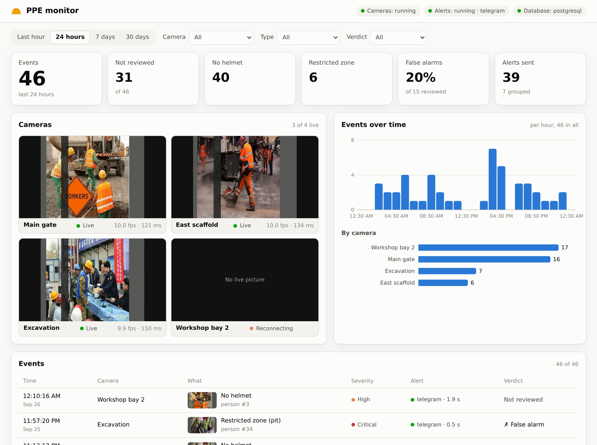

# Phase 5: storing events, alerts to your phone, and the dashboard

**Book:** Chapter 22, using Chapters 13 and 14 · **Why it is built this way:**
[decision 0008](decisions/0008-storage-alerts-and-dashboard.md) · **Settings:** `configs/server.yaml`,
and `configs/secrets.env` for tokens and passwords (not in git)

```bash
bash ~/Documents/ppe-monitor/scripts/mac_phase5.sh setup      # once, ~5 min: libraries, PostgreSQL, the database
bash ~/Documents/ppe-monitor/scripts/mac_phase5.sh telegram   # once: connect the alerts to your Telegram
bash ~/Documents/ppe-monitor/scripts/mac_phase5.sh check      # ~5 min: tests, and the whole path end to end
bash ~/Documents/ppe-monitor/scripts/mac_phase5.sh run        # cameras -> database -> your phone + the dashboard
```

## What was built

```
camera service (run_cameras.py --db --live)
  video loop ── event ──► memory queue ──► writer thread: evidence image + clean frame -> data/events/<day>/
                                                          event + one alert per channel -> PostgreSQL (one transaction)
             └─ newest frame of each camera, ~1/s ──► runs/live_tiles/<camera>.jpg
alert worker (alert_worker.py) ◄── due alerts (the alerts table is the queue)
  rate limit ─► Telegram sendPhoto / email ─► sent (with the delay) · retried · held -> summary · failed
dashboard (serve_dashboard.py, http://127.0.0.1:8080) ◄── PostgreSQL, the images, the live tiles
```

| Part | File | What it does |
|---|---|---|
| **Settings** | `backend/settings.py` | `configs/server.yaml`, plus secrets from `configs/secrets.env` or the environment |
| **Tables** | `backend/db.py` | events, alerts (the queue), cameras and their log, rules, zones, runs, heartbeats. PostgreSQL or SQLite |
| **Store** | `backend/store.py` | writes events with their images; lists, filters and counts them; hands alerts to the worker; deletes old images (keeping false alarms) |
| **From the video loop** | `backend/sink.py` | `DbSink`: a memory queue and a writer thread, so the loop never waits. `LiveTiles`: the dashboard's camera pictures |
| **Channels** | `backend/channels.py` | Telegram (Bot API, photo + caption) and email (SMTP), each saying whether a failure is worth retrying |
| **Alert worker** | `backend/worker.py` | rate limit and summaries, retries with backoff, delivery time |
| **API and page** | `backend/api.py`, `dashboard/static/` | FastAPI; one page in plain HTML, CSS and JavaScript, nothing from the internet |
| **Local PostgreSQL** | `backend/localpg.py`, `scripts/db.py` | the project's own server in `data/postgres`, on 127.0.0.1:5433 |
| **Scripts** | `scripts/alert_worker.py`, `serve_dashboard.py`, `telegram_setup.py`, `check_phase5.py`, `mac_phase5.sh` | |

**The dashboard** has these parts:
- a header saying whether the camera service and the alert worker are running;
- one row of filters (time range, camera, type, verdict) that scopes everything below it;
- counts: events, not yet reviewed, no helmet, restricted zone, the false-alarm share, alerts sent;
- live camera pictures with each camera's rate and lag;
- events per hour, and events per camera;
- the event feed, where a click opens the evidence image (or the clean frame), the facts, how each
  alert went, and the verdict: **Confirm violation**, **False alarm**, or **Undo**, with a note.

It works on a phone (the link in a Telegram message opens the event) and in dark mode.

## Checked in the cloud (26 Sep 2026)

**Tests:** 205 pass (1 skipped). 18 of them are Phase 5's, run on SQLite and again on PostgreSQL 16:
- storage, filters and counts;
- deleting old images while keeping false alarms;
- sending with the delay recorded, and text-only channels;
- retrying and giving up;
- the rate limit, holding alerts and summarising them;
- recovering alerts left half-sent;
- Telegram's replies (sent, busy, wrong chat, one chat of two failing);
- the writer thread never blocking, and retrying;
- the API, its images and verdicts, and the password.

**End to end** (`scripts/check_phase5.py`): PostgreSQL 16, 2 clips as cameras, the CPU model.
The stand-in for Telegram refused the first 3 messages, and the rate limit was 2 alerts per
camera per 30 s.

| Check | Result | Detail |
|---|---|---|
| every event stored, with its images; none dropped | PASS | 4 raised, 4 stored, 0 dropped |
| every alert delivered with its picture | PASS | 4 messages, all with the picture |
| alerts not caught in the outage arrive within 5 s | PASS | 0.58 s |
| refused messages retried and delivered | PASS | 3 refused; 2 alerts got through on a later attempt |
| past the rate limit: held, then summarised | PASS | 1 alert held, reported in 1 summary |
| the dashboard's API shows the same events and records a verdict | PASS | |
| the video loop kept its pace | (CPU only) | 4.4 frames/s per camera: this 2-core machine is too slow, with or without Phase 5 |

**The real scripts together** (`run_cameras.py --db --live`, `alert_worker.py`,
`serve_dashboard.py` and a stand-in Telegram, on PostgreSQL): 4 events, 4 alerts, each delivered
**0.4–0.7 s after its event**, with its picture. The live tiles were written, and the dashboard
showed both cameras and both services.

## On the Mac (MacBook Air M4, 26 Sep 2026)

**`setup`** installed PostgreSQL 16.15 from conda-forge into the project environment, created the
server in `data/postgres` and the database (127.0.0.1:5433). **`telegram`** connected the bot
(@CVhelmet_bot) to your chat and sent the test alert.

**`check`:** 213 tests pass, Phase 5's also on PostgreSQL. The end to end check passed every one
of its 7 checks, with Core ML and 4 cameras:

| Check | Result | Detail |
|---|---|---|
| every event stored, with its images; none dropped | PASS | 5 raised, 5 stored, 0 dropped |
| every alert delivered with its picture | PASS | 5 messages, all with the picture |
| alerts not caught in the outage arrive within 5 s | PASS | 0.2 s |
| refused messages retried and delivered | PASS | 3 refused; 2 alerts got through on a later attempt |
| past the rate limit: held, then summarised | PASS | 1 alert held, reported in 1 summary |
| the dashboard's API shows the same events and records a verdict | PASS | |
| **the video loop kept its pace** | PASS | **10.0 frames/s on all 4 cameras** with storage on; loop step median 13 ms |

**Real alerts to your phone** (`run clips`: 4 clips as cameras, the real Telegram):

| | Alert on the phone, after the event | Where the time went |
|---|---|---|
| First run | 18.6–23.3 s | about 15 s waiting for IPv6 to time out on the first connection, then one photo after another |
| **After the fix** | **3.1–4.1 s** | 0.4 s from the event to the worker; 2.7–2.9 s to upload the pictures, 4 at a time |

**What `telegram --speed` found:** this network announces IPv6 for api.telegram.org but doesn't
carry it.
- A plain IPv6 connection **timed out after 5 s**; IPv4 connected in **264 ms**.
- Letting the system choose, the first call to Telegram took **5.85 s**. With IPv4 only it took
  **0.85 s**. A repeat call on the open connection took 0.35 s either way.
- One 107 KB picture took **1.98 s** to send, so the upload is about 1 Mbit/s.

**The fixes** (in `backend/channels.py` and `worker.py`):
- **IPv4 only** for Telegram (`ip: ipv4` in `configs/server.yaml`), and new connections give up
  after 5 s instead of 15.
- **One connection, kept open.** It is checked when the worker starts and once a minute when
  idle.
- **Smaller pictures:** at most 1280 px, the most Telegram shows.
- **Up to 4 alerts sent at a time.**
- **The log says where the time went:** waiting in the queue, or sending.

**The dashboard didn't open by itself at first.** Its address reached the log file only when the
program ended (Python buffers its output when writing to a file). So `run` didn't know what to
open. It now waits until the dashboard answers, prints its address and opens it.
`mac_phase5.sh dashboard` opens the dashboard alone, to look back at events.

**What the numbers mean.** The book's "done when" asks for the alert and its picture on the phone
"within a few seconds". It is **3–4 s** here, and most of that is uploading pictures on a
1 Mbit/s connection. With `photo: false` an alert is text only, which should bring it under a
second (0.4 s to the worker plus a 0.35 s call); the picture stays on the dashboard.



*The dashboard, filled with sample events for this picture.*
